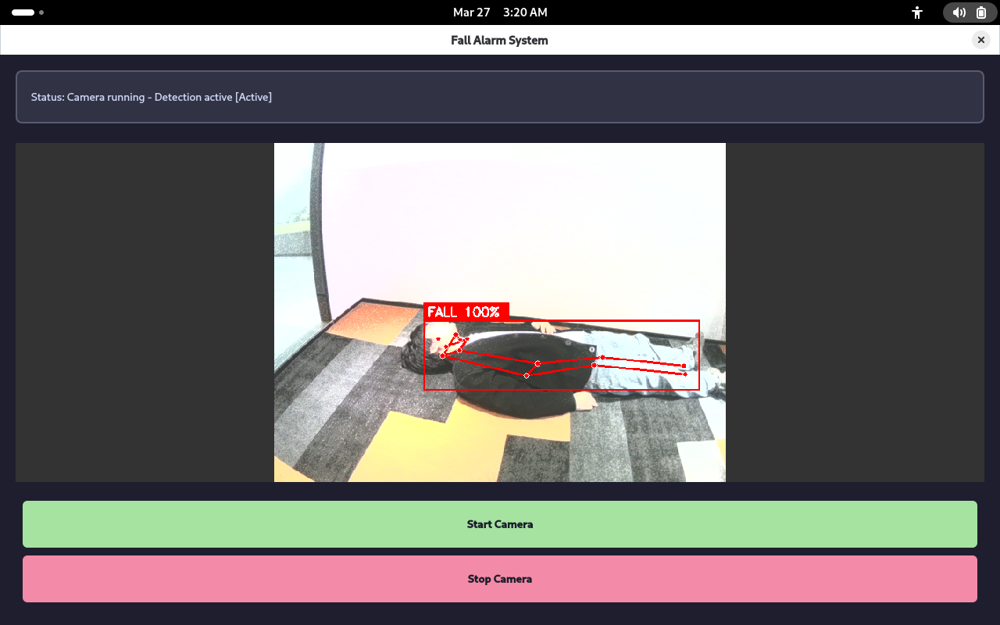
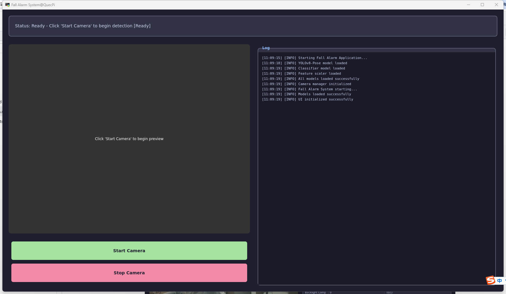

# 跌倒警报应用

[English](README.md) | 中文

本项目是一个基于Quectel Pi H1单板电脑实现的防跌倒智能监护应用，通过USB摄像头实时采集画面，利用YOLOv8-Pose进行人体关键点检测，使用预训练的随机森林分类器判断用户是否发生跌倒，在检测到跌倒时自动启动警报灯并上传报警图片。



## 功能特性
- 基于YOLOv8-Pose的实时人体姿态识别
   - 实时检测17个人体关键点
   - 支持多人同时检测
   - CPU推理，无需GPU
- 智能跌倒判断
   - 随机森林分类器判断
   - 多特征融合（关键点、角度、身形）
   - 连续帧确认，有效降低误报
- 自动报警机制
   - 跌倒检测时启动警报灯
   - 自动保存报警图片
   - 上传至远程服务器,可在apk端接收通知并查看
---

## 环境配置

### 系统要求
- **操作系统**: Linux/Debian 13
- **Python版本**: 3.8+
- **Qt版本**: Qt6（通过PySide6）
- **OpenCV版本**: 4.8+
- **PySide6版本**: 6.5+
- **numpy版本**: 1.24+
- **scikit-learn版本**: 1.3+
- **ultralytics版本**: 8.0+

### 依赖安装

```bash
pip install -r requirements.txt
```

### 系统依赖（Linux）
```bash
# 基础依赖
sudo apt-get install python3-pip libatlas-base-dev libjasper-dev

# 可选：串口通信支持（警报灯控制）
sudo apt-get install python3-serial
```

---

## 项目代码结构简介

```
├── requirements.txt             # Python依赖列表
├── README.md                    # 项目说明文档（英文）
├── README_zh.md                 # 项目说明文档（中文）
│
├── src/                         # 防跌倒检测应用源码目录
│   ├── main.py                  # 主入口，启动防跌倒检测应用
│   ├── camera_manager.py        # 摄像头管理类，负责视频采集、预览、跌倒检测
│   ├── fall_detector.py         # 跌倒检测器，YOLOv8推理和分类
│   ├── light_control.py         # 警报灯控制，通过串口通信
│   ├── ui_manager.py            # UI界面管理，PySide6 GUI实现
│   └── log_manager.py           # 日志管理类
│
├── model/                       # 预训练模型目录
│   ├── yolov8n-pose.pt          # YOLOv8-Nano Pose模型
│   ├── fall_multi_person_model.pkl      # 随机森林分类器（跌倒判断）
│   └── feature_scaler_multi.pkl         # 特征缩放器
│
├── picture/                     # 报警图片存储目录（运行时自动创建）
│   ├── fall_20240326_143022.jpg # 报警图片示例
│   └── ...
│
└── fall_train/                  # 模型训练工具目录（参考实现）
    ├── extract_features_yolo.py # 特征提取脚本
    ├── train_model_yolo.py      # 模型训练脚本
    ├── fall_multi_person_features.csv   # 特征数据集
    └── fall_dataset/            # 训练数据目录
        ├── down/                # 跌倒姿态图片
        ├── sit/                 # 坐着姿态图片
        └── up/                  # 站立/行走姿态图片
```
---

## 硬件要求

### USB摄像头（规格不硬性要求，以下是本项目使用规格）
- **接口类型**: USB
- **分辨率要求**: 
  - 推荐分辨率: 1280×720或更高
  - 支持其他分辨率的标准USB摄像头
- **帧率**: 支持15fps以上
- **输出格式**: YUYV/MJPG

### 警报灯（可选）
- **接口类型**: USB转串口或GPIO
- **通信协议**: 串口通信（波特率9600 bps）
- **控制命令**: 十六进制指令序列

### 运行环境
- **开发板/PC**: 支持USB摄像头的Linux设备
- **内存**: 建议2GB以上（YOLOv8推理需要）
- **GPU**: 不要求（纯CPU计算）
- **网络**: 可选（用于上传报警图片到服务器）

---

## 使用流程

### 完整防跌倒检测流程

```
┌─────────────────────────────────────────────────────────────
│                   防跌倒检测应用使用流程                     
├─────────────────────────────────────────────────────────────
│  第一步：准备模型文件                                        
│  ├── 下载 yolov8n-pose.pt 到 model/ （或直接使用当前model目录下的）                       
│  ├── 准备 fall_multi_person_model.pkl         
│  └── 准备 feature_scaler_multi.pkl             
│                                                             
│  第二步：安装依赖                                            
│  ├── pip install -r requirements.txt                        
│  └── sudo apt-get install python3-serial（可选）            
│                                                              
│  第三步：运行防跌倒检测应用                                  
│  ├── cd src                                                 
│  ├── python3 main.py                                        
│  ├── 启动摄像头预览和检测                            
│  └── 检测到跌倒时自动启动报警                                
│                                                                                       
└─────────────────────────────────────────────────────────────
```

### 安装依赖

**运行命令：**
```bash
pip install -r requirements.txt
```

**可选依赖（警报灯功能）：**
```bash
sudo pip install pyserial
sudo usermod -a -G dialout $USER  # 配置串口权限
```

### 运行应用

**运行命令：**
```bash
cd src
python3 main.py
```



**应用界面说明：**

| 界面区域 | 功能说明 |
|---------|---------|
| 摄像头预览 | 显示实时视频流，标注检测到的人体和跌倒状态 |
| 日志区域 | 显示模型加载、检测结果、警报状态等日志信息 |
| 报警提示 | 顶部显示跌倒警报信息（带时间戳） |
| 状态栏 | 显示当前摄像头、FPS、检测状态 |

**演示案例**


---

## 检测参数配置

跌倒检测相关的关键参数可在 `src/fall_detector.py` 中修改：

```python
# 关键点检测配置
MIN_CONFIDENCE = 0.4           # 关键点置信度阈值
MIN_KEYPOINTS = 10             # 有效关键点最少数量
YOLO_IMG_SIZE = 320            # YOLOv8输入图像大小

# 跌倒判断阈值
FALL_BODY_ANGLE_THRESHOLD = 55        # 身体倾角阈值（度）
FALL_HEIGHT_RATIO_THRESHOLD = 1.2     # 身体高宽比阈值
FALL_MIN_CONFIDENCE = 0.75            # 分类器置信度阈值
FALL_CONFIRM_FRAMES = 3               # 跌倒确认帧数
```

### 服务器配置

报警图片上传相关配置在 `src/camera_manager.py` 中：

```python
SERVER_IP = "118.25.198.12" # 替换为你的服务器IP地址
SERVER_UPLOAD_URL = f"http://{SERVER_IP}:8000/upload_fall" # 替换成你自己的服务端上传接口
FALL_SAVE_INTERVAL = 1.0
```

## 技术原理

### 跌倒检测流程

```
视频采集
   ↓
YOLOv8-Pose关键点检测（17个关键点）
   ↓
特征提取（关键点、角度、身形）
   ↓
特征标准化（使用scaler）
   ↓
随机森林分类器推理
   ↓
跌倒置信度判断
   ↓
连续帧确认（FALL_CONFIRM_FRAMES）
   ↓
触发警报 → 启动警报灯 → 保存图片 → 上传服务器
```


## 常见问题

### 模型加载

**Q: 模型加载失败，显示"Model not found"**

A: 检查以下几点：
1. 确保 `model/` 目录存在
2. 检查模型文件名是否正确
   - `yolov8n-pose.pt`
   - `fall_multi_person_model.pkl`
   - `feature_scaler_multi.pkl`
3. 尝试手动下载模型：
   ```bash
   mkdir -p model
   wget https://github.com/ultralytics/assets/releases/download/v0.0.0/yolov8n-pose.pt \
        -O model/yolov8n-pose.pt
   ```

### 摄像头

**Q: 找不到摄像头或摄像头无法打开**

A: 检查摄像头连接：
```bash
# 列出可用摄像头
ls -la /dev/video*

# 使用v4l2-ctl查看详细信息
v4l2-ctl --list-devices
v4l2-ctl --list-formats -d /dev/video0
```

**Q: 摄像头预览卡顿或延迟大**

A: 优化性能：
1. 降低分辨率：改为640×480
2. 增加检测间隔：`DETECT_INTERVAL = 0.3`
3. 降低YOLOv8输入尺寸：`YOLO_IMG_SIZE = 256`
4. 禁用上传功能进行本地测试

### 跌倒检测

**Q: 误报率高（正常动作被当作跌倒）**

A: 调整参数降低误报：
1. 增加分类器阈值：`FALL_MIN_CONFIDENCE = 0.85`
2. 增加确认帧数：`FALL_CONFIRM_FRAMES = 5`
3. 增加角度和比例阈值
4. 重新训练分类器，增加坐下、弯腰等负样本

**Q: 漏检率高（没有检测到实际跌倒）**

A: 调整参数提高灵敏度：
1. 降低分类器阈值：`FALL_MIN_CONFIDENCE = 0.70`
2. 降低确认帧数：`FALL_CONFIRM_FRAMES = 2`
3. 降低关键点要求：`MIN_KEYPOINTS = 8`
4. 优化摄像头视角（距离1-3m，高度1.5-2m）

**Q: 只能识别特定方向的跌倒**

A: 重新训练模型：
1. 在 `fall_dataset/down/` 中增加多个方向的跌倒样本
2. 包括向前、向侧面、向后倾倒
3. 增加数据量（每类至少500张）
4. 重新运行训练脚本


## 性能优化

### 推理加速

```python
# 降低YOLOv8输入尺寸
YOLO_IMG_SIZE = 256  # 从320降低

# 增加检测间隔
DETECT_INTERVAL = 0.2  # 从0.15增加
```

### 内存优化

```python
# 定期清理日志
if len(LogManager._logs) > 100:
    LogManager.clear_logs()

# 限制图片保存频率
FALL_SAVE_INTERVAL = 1.0  # 1秒最多保存一张
```

### 降低误报

使用连续帧确认和高置信度阈值：

```python
FALL_CONFIRM_FRAMES = 5      # 5帧连续才判定为跌倒
FALL_MIN_CONFIDENCE = 0.80   # 分类器置信度 >= 0.8
```

---